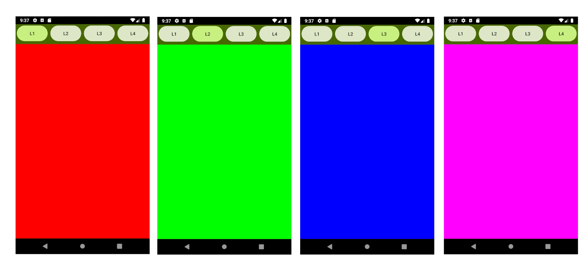

# MENULAYOUTS

This project is designed to experiment with various XML layouts or Jetpack Compose layouts with the same app. It uses four buttons at the top to switch between layouts. The app retains the layout being displayed even when the device is rotated, thanks to the use of memory preservation. Also selected layout is displayed. You can change to your theme and colors.

## Preview

